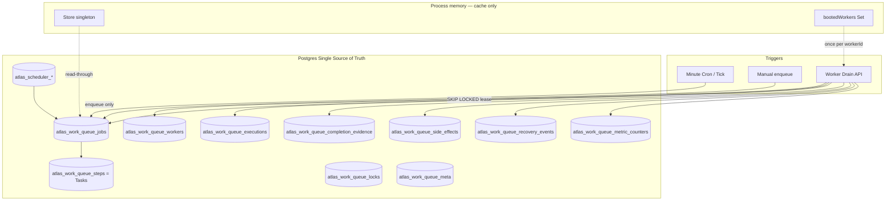
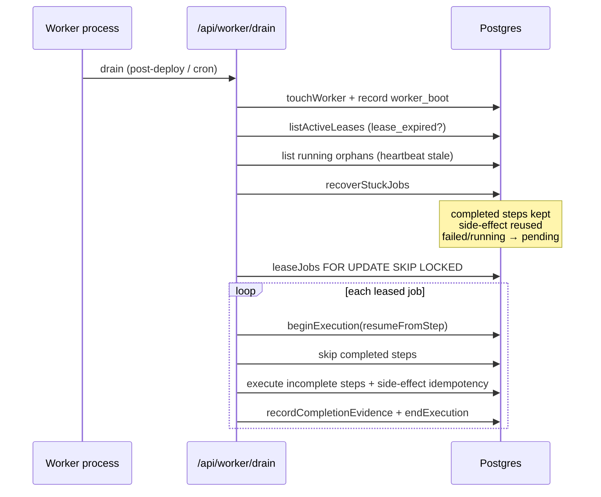

# Production Blocker #4 — Durability / Crash Recovery / Idempotency

Branch: `cursor/durability-blocker4-83f5`

## 【ATLAS機能評価】

```
機能名：Production Blocker #4 — Durability / Crash Recovery / Idempotency
ユーザー価値：クラッシュ・再起動・デプロイ後も仕事を失わず、一度だけ最後まで完了する
差別化：DB SoT + Lease/SKIP LOCKED + ステップ再開 + Completion Evidence + Owner realtime
繰り返し作業の削減：はい
AI必要度：不要
AIなしで実装可能：はい
運営コスト：中（Postgres・Worker drain・Owner dashboard）
外部APIコスト：無（Durability自体）
コスト削減案：キャッシュはprocess memoryのみ / side-effect再利用 /
  AIは成果物Step到達時のみ / 承認後実行 / 再生成禁止
優先度：P0
```

## ゴール判定

**CONDITIONAL PASS（コード+CI）**

| 条件 | 結果 |
|---|---|
| process memory / in-memory Queue を本番 SoT にしない | YES（CI ban + production throw） |
| file fallback を本番 SoT にしない | YES（FORCE/ALLOW/MEMORY_FAST 本番禁止） |
| Job に idempotencyKey、0回 or 1回実行 | YES（unique + lease + side-effect） |
| Worker 再起動後に途中再開（最初から禁止） | YES（完了Step保持 + evidence） |
| Metrics 永続 | YES（metric_counters + meta rings） |
| Owner realtime 確認 | YES（5秒ポーリング durability snapshot） |
| 本番 Preview ライブ 1000 job 障害注入 | 未（ops 依存） |

---

## 1. 永続化構成図



### Entity → Table

| Entity | Table |
|---|---|
| Job | `atlas_work_queue_jobs` |
| Task | `atlas_work_queue_steps`（正式名称 Task = Step） |
| Execution | `atlas_work_queue_executions` |
| Completion Evidence | `atlas_work_queue_completion_evidence` |
| Scheduler | `atlas_scheduler_schedules` / execution_logs |
| Memory | durable Memory domain（work-queue dashboard は参照のみ） |
| Notification | side-effect + `notification_count` counter |
| Metrics | `atlas_work_queue_metric_counters` + meta rings |
| Retry | job.retry_history + `retry_count` |
| Recovery | `atlas_work_queue_recovery_events` |
| Idempotency Key | job/step/side_effect UNIQUE |
| Lease | job.lease_owner / lease_expires_at |
| Lock | `atlas_work_queue_locks` + scheduler lock |

Migrations:

- `20260802_atlas_work_queue.sql`
- `20260803_atlas_work_queue_reliability.sql`
- `20260804_atlas_scheduler_registry.sql`
- `20260805_atlas_work_queue_durability.sql`

---

## 2. Recovery フロー



再開ルール:

1. 完了 Step は再実行しない
2. side-effect が既にあれば結果を復元して completed 扱い
3. Lease 切れは reclaim 可能（二重 lease 不可）
4. 「最初からやり直し」は禁止

---

## 3. Idempotency 設計

| Layer | Key | 保証 |
|---|---|---|
| Job | `idempotencyKey`（必須・発生時は occurrence から導出） | UNIQUE → create 0 or 1 |
| Occurrence | `(automation_id, occurrence_key)` | Scheduler 二重発火防止 |
| Step | `buildStepIdempotencyKey(jobId, stepId)` | Step 単位 |
| Side effect | `atlas_work_queue_side_effects.idempotency_key` | 外部副作用 0 or 1 |
| Evidence | UNIQUE `(job_id, step_id, kind)` | 完了証跡 |

二重実行防止:

- Lease: `FOR UPDATE SKIP LOCKED`
- Enqueue duplicate → `created: false` + `duplicate_count++`
- Side-effect insert `ON CONFLICT DO NOTHING`（欠損時は fail-closed、ephemeral 禁止）

---

## 4. クラッシュ復旧テスト

ファイル: `lib/work-queue/blocker4-durability.test.ts`

| ケース | 期待 |
|---|---|
| mid-job crash → boot recover → drain | 完了Step維持、job completed、side-effect 一意 |
| stuck recovery | completed steps を wipe しない |
| worker boot events | `worker_boot` / `stuck` / lease_expired 記録 |

実行:

```bash
npm test -- --run lib/work-queue/blocker4-durability.test.ts
```

---

## 5. 二重実行防止テスト

| ケース | 期待 |
|---|---|
| 同一 idempotencyKey で enqueue×2 | 2件目 `created:false`、同一 jobId |
| 二 Worker 同時 lease | 片方のみ取得 |
| side-effect 二重 write | 2件目 `created:false`、結果不変 |

---

## 6. Production 運用手順

1. **Migration 適用**（必須・fail-closed）

```bash
DATABASE_URL=... ./scripts/ci/apply-work-queue-migrations.sh
```

2. **環境変数**

| Env | Production |
|---|---|
| `DATABASE_URL` / `POSTGRES_URL` | 必須 |
| `ATLAS_WORK_QUEUE_FORCE_FILE` | **禁止** |
| `ATLAS_WORK_QUEUE_ALLOW_FILE` | **禁止** |
| `ATLAS_WORK_QUEUE_MEMORY_FAST` | **禁止** |
| `CRON_SECRET` / minute drain | 必須（enqueue + 独立 drain） |

3. **Deploy 後**

- Minute scheduler: tick（`drain=0`）→ 別経路 `/api/worker/drain`
- 最初の drain で `recoverOnWorkerBoot` が Running/Stuck/Retry/Lease切れを検知

4. **Owner 監視**

- `/owner/scheduler` — Durability panel（5秒更新）
- API: `/api/owner/work-queue/metrics`（`durability` 同梱）
- API: `/api/owner/work-queue/durability`

5. **障害時**

- Queue 滞留 → drain worker 増やす / stuck 確認
- Duplicate 急増 → Scheduler 二重 tick 調査（enqueue は安全）
- Recovery 急増 → heartbeat / leaseMs / worker OOM 調査
- file SoT エラー → DATABASE_URL 確認（本番は Postgres 以外拒否）

6. **CI gates**

- `node scripts/ci/work-queue-durability-ban.mjs`
- work-queue tests + postgres durability（DATABASE_URL 付き）

---

## 7. Metrics（永続）

| Metric | 保存先 |
|---|---|
| 開始/終了 | executions.started_at/ended_at + counters |
| 成功率/失敗率 | metrics() 集計 |
| 処理時間 | meta `execution_ms` ring |
| Retry数 | `retry_count` |
| Recovery数 | `recovery_count` + recovery_events |
| Duplicate数 | `duplicate_count` |
| Timeout数 | `timeout_count` |
| Queue長 | jobs status count |
| Notification数 | `notification_count` |

---

## 8. 残課題（本番ライブ）

1. Preview/本番での障害注入（kill -9 mid-job）実測
2. Legacy `lib/jobs` memory fallback の完全退役（Owner job-reliability 切替）
3. Notification store / DR queue の process memory 退役（別ドメイン）
