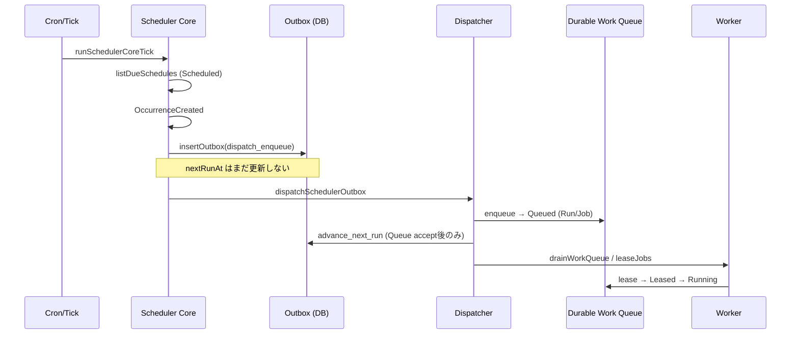
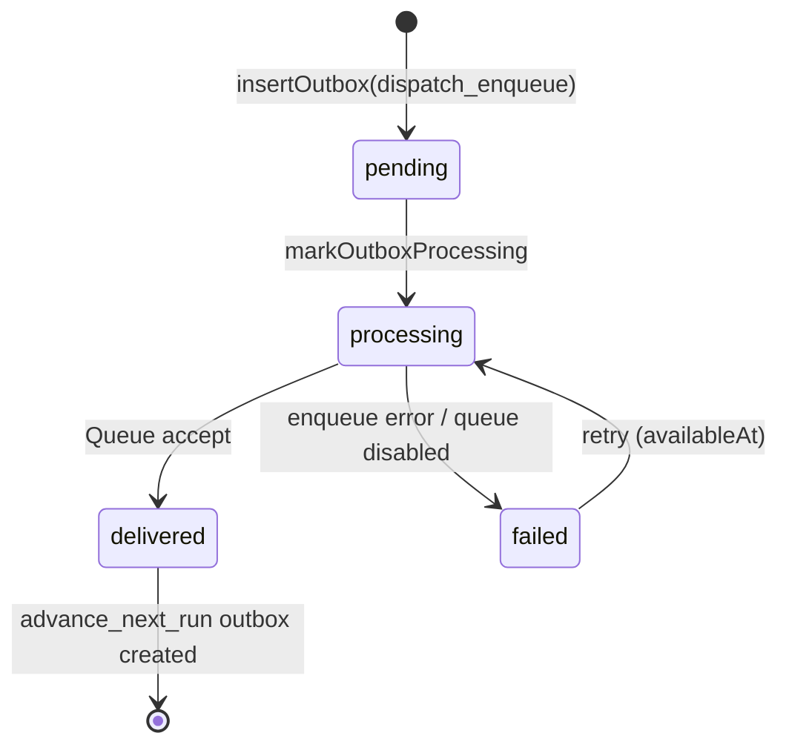
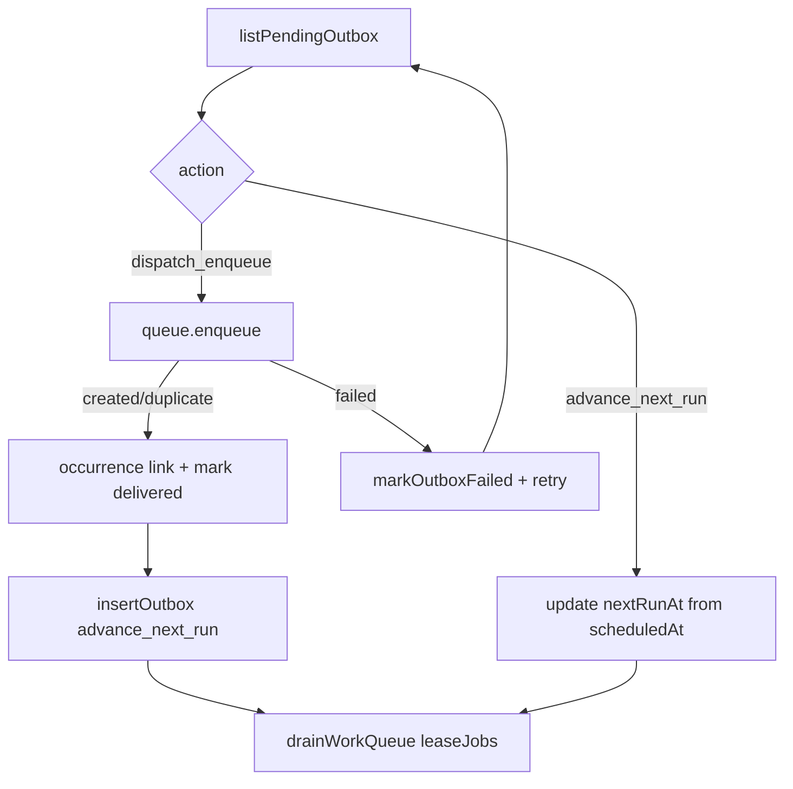

# Scheduler → Durable Queue → Worker Bridge — Phase 2-3

## 【ATLAS機能評価】

```
機能名：Scheduler → Durable Queue → Worker Bridge（2-3）
ユーザー価値：Job作成だけで止まらず、Queueへ入りWorkerが取得開始できる
差別化：Outbox Pattern で DB commit 後の Queue dispatch を保証
繰り返し作業の削減：はい
AI必要度：不要
AIなしで実装可能：はい
運営コスト：低
外部APIコスト：無
コスト削減案：occurrence unique / Outbox retry / fire-and-forget禁止 / Worker bypass禁止
優先度：P0
```

## Scheduler → Queue 図



## Outbox 図



**絶対禁止:** enqueue 失敗なのに completed / nextRunAt のみ更新 / Run のみ作成

## Dispatcher 図



Kill switches (test/ops):

- `SCHEDULER_BRIDGE_DISPATCHER_DISABLED=true`
- `SCHEDULER_BRIDGE_QUEUE_DISABLED=true`

## Queue Schema（投入時必須フィールド）

| Field | Source |
|-------|--------|
| enqueue / enqueueResult | Dispatcher result (`created` / `duplicate` / `failed`) |
| queueId | `atlas_work_queue_jobs` or `file-work-queue` |
| jobId | Work Queue job id |
| runId | Work Queue run id |
| occurrenceId | `occurrenceKey` |
| createdAt | job.createdAt |
| priority | schedule priority |
| status | job.status (`queued`…) |
| retryPolicy | `{ maxAttempts, attempt }` |

Outbox unique: `(occurrence_key, job_id)` with `job_id="pending"` for dispatch intents (stable; real ids stored in payload as `dispatchedJobId` / `dispatchedRunId`).

Work Queue unique: `(automation_id, occurrence_key)`.

## Lifecycle

`Scheduled → OccurrenceCreated → RunCreated → JobCreated → Queued → Leased → Running`

Worker は Queue `leaseJobs` からのみ取得（Run/Job 直接検索・Queue bypass 禁止）。

## Metrics

Process-local + durable snapshot via `getSchedulerBridgeMetricsSnapshot()` / Owner `/api/owner/work-queue/metrics` → `bridge`:

- enqueue latency / dispatch latency / queue wait / lease wait
- duplicate enqueue / failed enqueue / retry enqueue
- Queue Length / Oldest Job / Retry Queue / Dead Letter / Running / Waiting / Outbox Pending

## Health

- `GET/POST /api/internal/scheduler/health` → `bridge`
- Owner Work Queue Panel → Queue Health metrics

## Tests

`lib/scheduler-core/bridge/bridge.test.ts`

- 1 / 10 / 100 Job
- concurrent enqueue
- Dispatcher停止 / Queue停止 / DB停止相当 / Worker停止
- Duplicate enqueue / Outbox Retry
